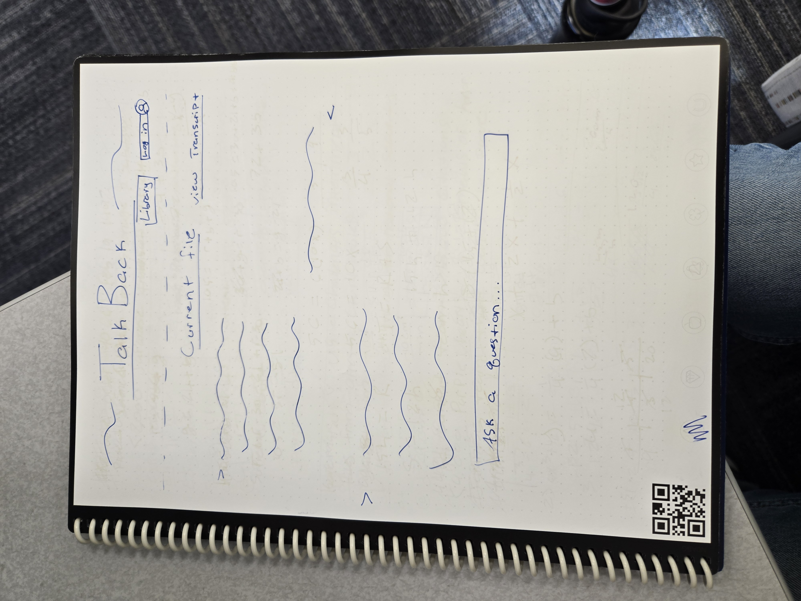
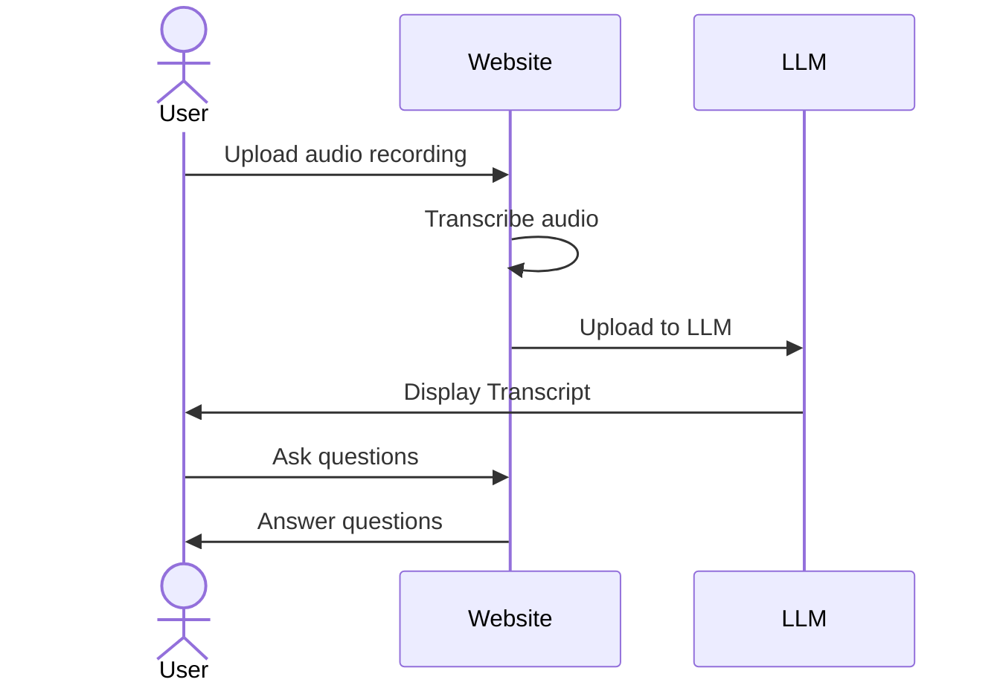

# TalkBack

[My Notes](notes.md)

TalkBack is an interactive note taking app that allows you to upload audio recordings of seminars, lectures, personal notes, or any other audio content. The audio is transcribed and uploaded to a Large Language Model, allowing you to interact with the audio notes in a conversational manner. Since the model has access to a word-for-word recording of the lecture or seminar, you can ask questions about the content and get answers in real time. TalkBack is effectively an interactive digital notebook, perfect for students, professionals, and anyone who wants to utilize notes in a more engaging way.

> [!NOTE]
>  This is a template for your startup application. You must modify this `README.md` file for each phase of your development. You only need to fill in the section for each deliverable when that deliverable is submitted in Canvas. Without completing the section for a deliverable, the TA will not know what to look for when grading your submission. Feel free to add additional information to each deliverable description, but make sure you at least have the list of rubric items and a description of what you did for each item.

> [!NOTE]
>  If you are not familiar with Markdown then you should review the [documentation](https://docs.github.com/en/get-started/writing-on-github/getting-started-with-writing-and-formatting-on-github/basic-writing-and-formatting-syntax) before continuing.

## 🚀 Specification Deliverable

> [!NOTE]
>  Fill in this sections as the submission artifact for this deliverable. You can refer to this [example](https://github.com/webprogramming260/startup-example/blob/main/README.md) for inspiration.

For this deliverable I did the following. I checked the box `[x]` and added a description for things I completed.

- [x] Proper use of Markdown
- [x] A concise and compelling elevator pitch
- [x] Description of key features
- [x] Description of how you will use each technology
- [x] One or more rough sketches of your application. Images must be embedded in this file using Markdown image references.

### Elevator pitch

TalkBack is an interactive note taking app that allows you to upload audio recordings of seminars, lectures, personal notes, or any other audio content. The audio is transcribed and uploaded to a Large Language Model, allowing you to interact with the audio notes in a conversational manner. Since the model has access to a word-for-word recording of the lecture or seminar, you can ask questions about the content and get answers in real time. TalkBack is effectively an interactive digital notebook, perfect for students, professionals, and anyone who wants to utilize notes in a more engaging way.

### Design

This squence diagram shows the flow of the application. The user uploads an audio recording, the audio is transcribed and uploaded to the LLM, and the user can then interact with the notes in a conversational manner.

### Key features

- Secure user authentication and data storage
- Ability to store multiple audio recordings and notes
- User-friendly interface for uploading and interacting with audio recordings
- Ability to summarize the audio content
- Real-time transcription and LLM interaction
- Ability to ask questions about the audio content

### Technologies

I am going to use the required technologies in the following ways.

- **HTML** - Uses correct HTML elements and attributes to build the website and display chat interface. Also Includes library dropdown and login page.
- **CSS** - Asthetic design of the website and chat interface. Compatibility across different screen sizes and types.
- **React** - Provides login capabilities and allows for the chat interface to be displayed. Also allows for the library dropdown to be displayed and function.
- **Service** - backend service that handles the audio transcription and LLM interaction.
    - Supports login and registration systems.
    - Supports storing audio recordings and notes/chat history.
    - Supports audio transcription and LLM interaction.
- **DB/Login** - Stores user data and authentication information. Guest mode available but does not save any data.
- **WebSocket** - Used to send and receive messages between the LLM and server. Also used to send audio recordings to the transcription service and receive the transcription back.

## 🚀 AWS deliverable

For this deliverable I did the following. I checked the box `[x]` and added a description for things I completed.

<<<<<<< HEAD
- [x] **Server deployed and accessible with custom domain name** - [My server link](https://talkback.click).
=======
- [x] **Server deployed and accessible with custom domain name** - [TalkBack](https://talkback.click).
>>>>>>> a291010aae6486bb45d471c37bd5911bdb582514

## 🚀 HTML deliverable

For this deliverable I did the following. I checked the box `[x]` and added a description for things I completed.

- [x] **HTML pages** - Three HTML pages. One for tha chat/home page, one for log in, and one to view your library.
- [x] **Proper HTML element usage** - Body, Nav, Header, Main, Footer, Form, Input, Button, and Menu are all used correctly.
- [x] **Links** - The links are functional and take the user to the correct page.
- [x] **Text** - The text is functional and displays the correct information. Placeholders are used for the text that will be added by the user or by the LLM.
- [x] **3rd party API placeholder** - The api placeholder is the chat history, currently represented by a paragraph tag.
- [x] **Images** - The logo is displayed on all pages as an image.
- [x] **Login placeholder** - There is a placeholder for the login page.
- [ ] **DB data placeholder** - I did not complete this part of the deliverable.
- [ ] **WebSocket placeholder** - I did not complete this part of the deliverable.

## 🚀 CSS deliverable

For this deliverable I did the following. I checked the box `[x]` and added a description for things I completed.

- [ ] **Header, footer, and main content body** - I did not complete this part of the deliverable.
- [ ] **Navigation elements** - I did not complete this part of the deliverable.
- [ ] **Responsive to window resizing** - I did not complete this part of the deliverable.
- [ ] **Application elements** - I did not complete this part of the deliverable.
- [ ] **Application text content** - I did not complete this part of the deliverable.
- [ ] **Application images** - I did not complete this part of the deliverable.

## 🚀 React part 1: Routing deliverable

For this deliverable I did the following. I checked the box `[x]` and added a description for things I completed.

- [ ] **Bundled using Vite** - I did not complete this part of the deliverable.
- [ ] **Components** - I did not complete this part of the deliverable.
- [ ] **Router** - Routing between login and voting components.

## 🚀 React part 2: Reactivity

For this deliverable I did the following. I checked the box `[x]` and added a description for things I completed.

- [ ] **All functionality implemented or mocked out** - I did not complete this part of the deliverable.
- [ ] **Hooks** - I did not complete this part of the deliverable.

## 🚀 Service deliverable

For this deliverable I did the following. I checked the box `[x]` and added a description for things I completed.

- [ ] **Node.js/Express HTTP service** - I did not complete this part of the deliverable.
- [ ] **Static middleware for frontend** - I did not complete this part of the deliverable.
- [ ] **Calls to third party endpoints** - I did not complete this part of the deliverable.
- [ ] **Backend service endpoints** - I did not complete this part of the deliverable.
- [ ] **Frontend calls service endpoints** - I did not complete this part of the deliverable.

## 🚀 DB/Login deliverable

For this deliverable I did the following. I checked the box `[x]` and added a description for things I completed.

- [ ] **User registration** - I did not complete this part of the deliverable.
- [ ] **User login and logout** - I did not complete this part of the deliverable.
- [ ] **Stores data in MongoDB** - I did not complete this part of the deliverable.
- [ ] **Stores credentials in MongoDB** - I did not complete this part of the deliverable.
- [ ] **Restricts functionality based on authentication** - I did not complete this part of the deliverable.

## 🚀 WebSocket deliverable

For this deliverable I did the following. I checked the box `[x]` and added a description for things I completed.

- [ ] **Backend listens for WebSocket connection** - I did not complete this part of the deliverable.
- [ ] **Frontend makes WebSocket connection** - I did not complete this part of the deliverable.
- [ ] **Data sent over WebSocket connection** - I did not complete this part of the deliverable.
- [ ] **WebSocket data displayed** - I did not complete this part of the deliverable.
- [ ] **Application is fully functional** - I did not complete this part of the deliverable.
